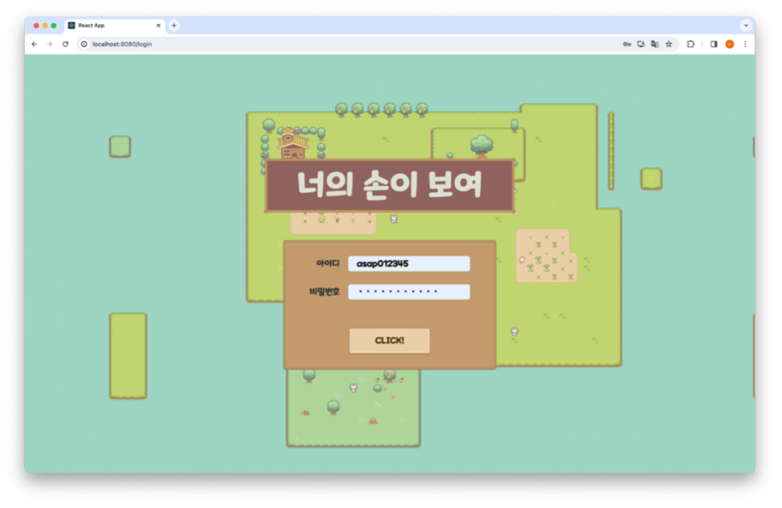
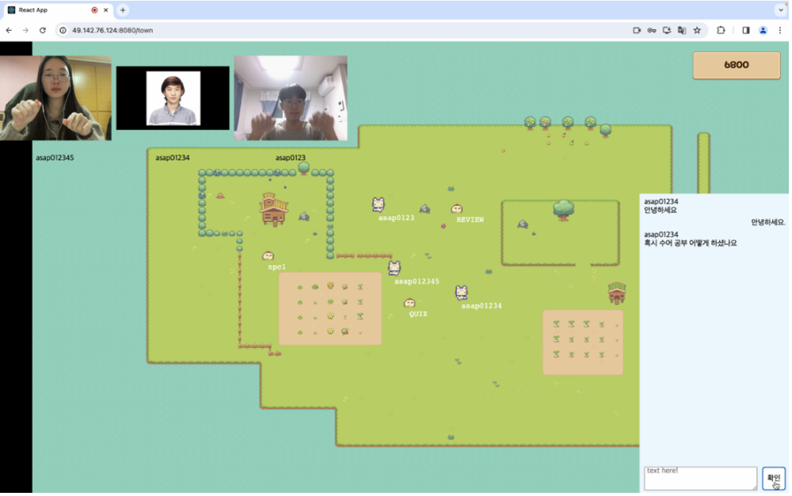
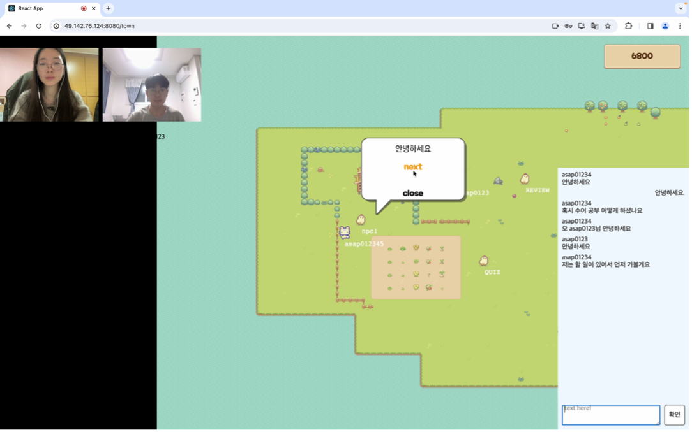
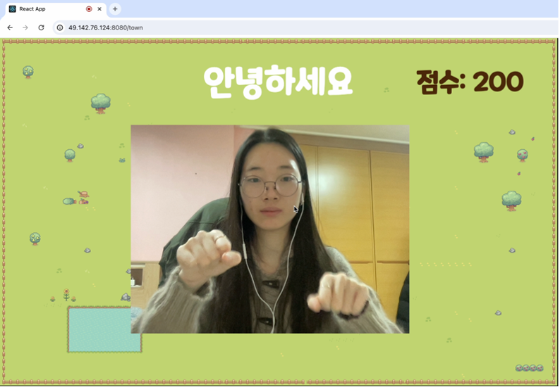
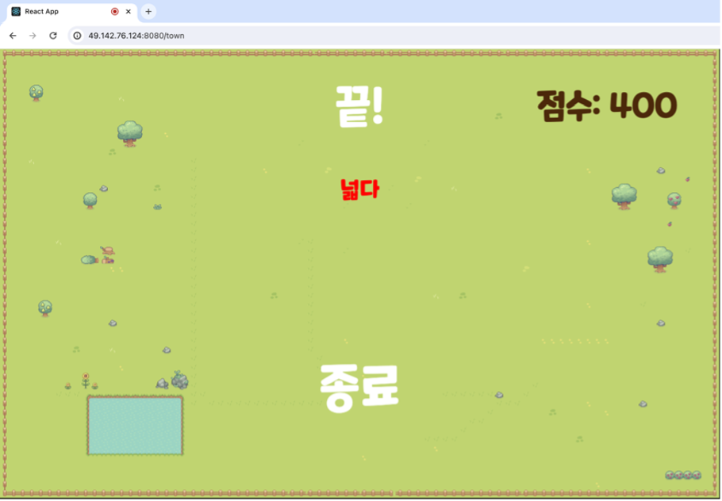
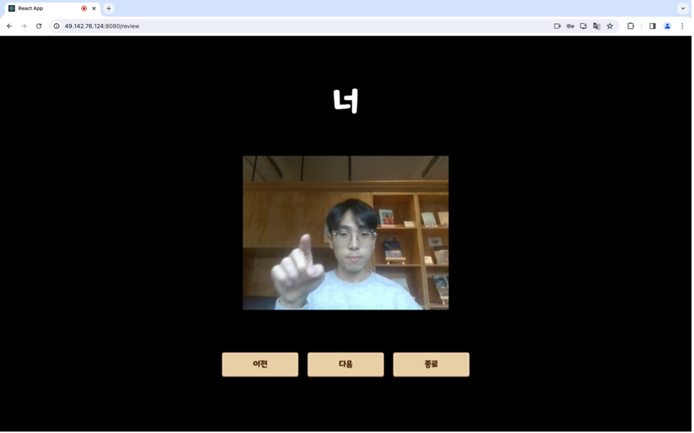

# Show Your Hands
## Meta-verse for learning Korean Sign Language(KSL) Easily
A Meta-verse designed for educating child deafs, or Deafs who are interested in learning KSL.

This meta-verse provides a more intuitive and interactive way for learning KSL utilizing web-cameras.
Also, by using deep-learning and a web-cam, this meta-verse teaches KSL to Deafs by recognizing their hand gestures and giving feedbacks.
## 개발 동기
### 청각 장애인 비율 증가
보건복지부는 2022년 말 기준 등록 장애인 중 청각 장애인은 16%로 2011년에 비해 10.4%에서 16.0%로 증가하는 추세입니다. 특히 지난해 새로 등록된 장애인 중 청각의 비중이 32.8%로 가장 많이 늘었다고 합니다.

### 수어로 소통할 수 있는 환경 부족
국가인권위원회에서 진행한 ‘청각장애인 고용차별 및 고용개선방안 실태조사’에서 설문한 청각장애인 320명을 설문한 결과 응답자들이 수어를 습득한 평균연령은 12.3세입니다. 언어능력 발달집중기인 유아동기에 수어를 익혔다는 응답은 26.5%에 그쳤습니다. 유아동기에 언어 발달이 활발하게 이루어지기 때문에, 원활한 의사소통을 위해서는 수어로 소통하는 환경에 노출되는 것이 중요합니다. 하지만, 청각장애인이 교육현장에서 수어가 배제되는 경우가 많아 교육 수준이 열악해진다는 문제점이 있습니다. 따라서, 수어로 의사소통 할 수 있는 환경의 필요성이 커지고 있습니다.

여러 논문에 따르면 청각장애아동이 초기 언어지도를 위해 수어를 활용하는 것이 효율적입니다. 수어 교육을 위한 커리큘럼이나 특수 교사의 필요성이 대두되고 있지만, 수어 통역사의 부족함 및 고충이 현재 문제점입니다. 청각 장애 학생이 집에서 쉽게 수어를 접하고 배울 수 있는 프로그램의 필요성을 느끼게 되어 게임을 이용한 수어 교육 메타버스 플랫폼인 ‘너의 손이 보여(너손보)’를 기획하게 되었습니다. 또한, ‘너손보’를 통해 온라인 커뮤니티를 형성하여 다른 청각 장애인들과 소통하고 사회성 발달에 긍정적 영향을 줄 수 있습니다.

## 주요 기능
### 2D 메타버스 로그인 및 회원가입

아이디, 닉네임, 비밀번호, 이메일을 통해 회원가입을 할 수 있습니다. 회원가입이 된 사용자는 로그인 페이지에서 로그인을 하게 되면 메인 타운 화면으로 이동할 수 있습니다.

### 커뮤니티

메인 페이지에서 사람들과 웹캠 및 채팅창을 통해 소통을 진행할 수 있습니다. 주 사용자들의 특성을 고려해 웹캠을 통해 수어로 대화가 가능하며 수어에 능숙하지 않아도 채팅 기능을 통해 소통이 가능하다. 자신의 캐릭터를 키보드를 활용해 조작 가능합니다.

### NPC 인터랙션

NPC와 대화 스토리를 통해서 수어를 배울 수 있습니다. NPC와의 인터렉션을 통해 퀴즈와 오답노트 페이지로 이동할 수 있습니다.

### 수어 게임

수어 게임 페이지로 이동하여 랜덤으로 제시된 수어를 3초 동안 맞추는 게임을 제공합니다. 정답을 맞추었을 때는 별 이펙트가 제시되고, 틀렸을 경우에는 비 이펙트가 제시됩니다. 정답의 경우 포인트가 증가합니다. 퀴즈가 종료되면 퀴즈에서 틀렸던 수어 단어들을 보여주고 종료 버튼을 통해 메인 타운에 다시 진입할 수 있습니다. 이때 오답이었던 수어들은 별도로 DB에 저장되어 오답 노트에 사용될 수 있습니다.



### 오답 노트

가장 많이 틀린 단어부터 가장 적게 틀린 단어를 예시 영상과 함께 순서대로 보여주어 복습 기회를 제공합니다.


## Dataset for learning KSL
In Model folder, there are keypoint data for learning KSL.
The data is collected by using mediapipe and opencv-python by 1 person, for 20 gestures, 30 times each.
Keypoint data has 30 frames for each gesture, and each frame has 258 keypoints.
Original video can be provided if requested by [this email](mailto:junjang99@naver.com).


## How to use
### 0. Prerequisites
#### 0.1. Running on server
- PostgreSQL 13^
- Python 3.10
- node.js 18^
- npm 8^
- yarn 1.22^
- Go 1.17^
- git
- mediapipe
- numpy
- tensorflow
- sklearn
- pandas
- joblib
- image
#### 0.2. Running on client
- Browser
- Web-cam
- Internet connection
- Python 3.10
- mediapipe
- opencv-python
- numpy
### 1. Download the project
```
git clone https://github.com/454P/Capstone_Full.git
```

### 2-1. Running server
- 5 Servers are required to run the project
#### Server for TCP Connection
```bash
cd registerTcpServer
go run server.go
```
#### Server for running the model
```bash
python modeling.py
```
#### Server for running the backend to connect with PostgreSQL
```bash
cd showyourhands
npm start
```
* Server connected with PostgreSQL uses process.env variables to connect with PostgreSQL.
* You should set the following variables in your environment.
``` text
DB_HOST
DB_USER
DB_PASSWORD
DB_DATABASE
DB_PORT
```
* This can also be done by creating a .env file in the showyourhands/src/config directory.

#### Server for running web
```bash
cd client
yarn install
yarn start
```

#### Server for running the webRTC
```bash
cd server
npm start
```

### Running client
- Before opening the web, start a web-cam and run connection for sending web-camera data to the server.
```bash
cd local_program
python app.py
```
* url needs to be set as the server's url.
* datas needs to be set as your ID and password.
  * If you don't have an ID and password, you can sign up on the web.
* HOST needs to be set as the TCP server's IP address.

- After running the connection, open the web on your browser.
- You can use the web by logging in with your ID and password.
